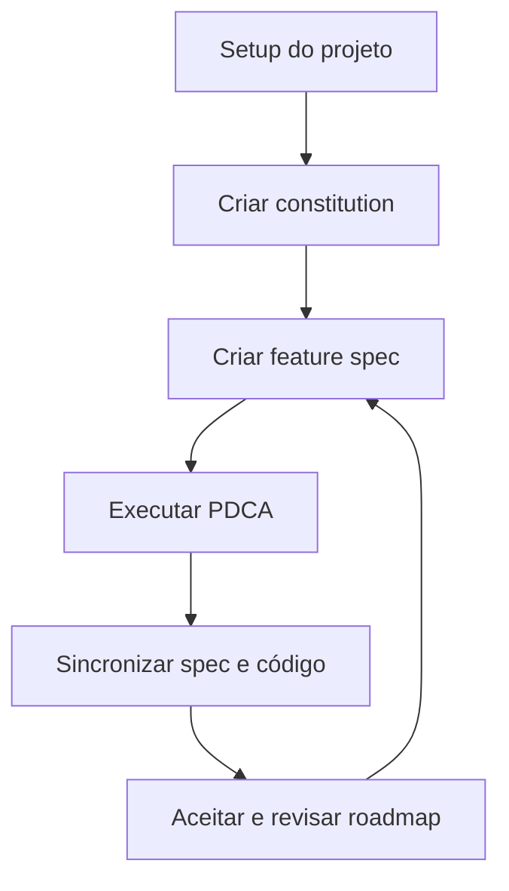
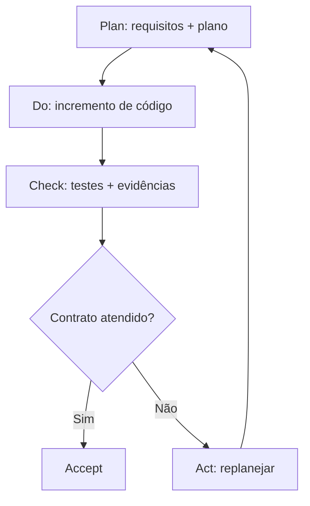
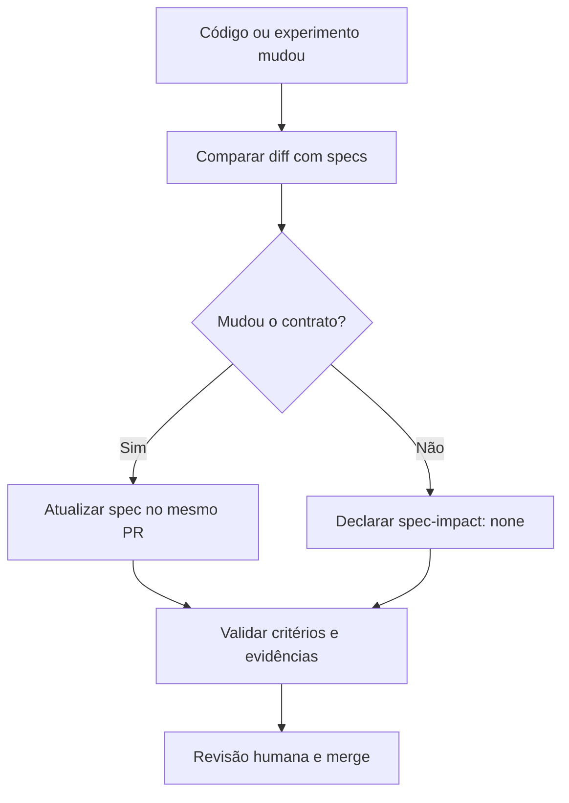
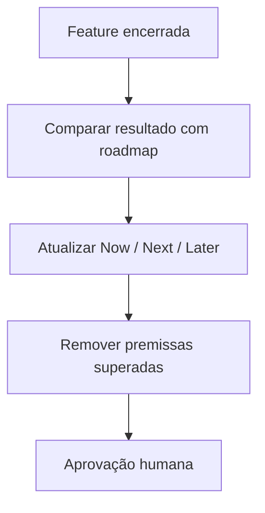
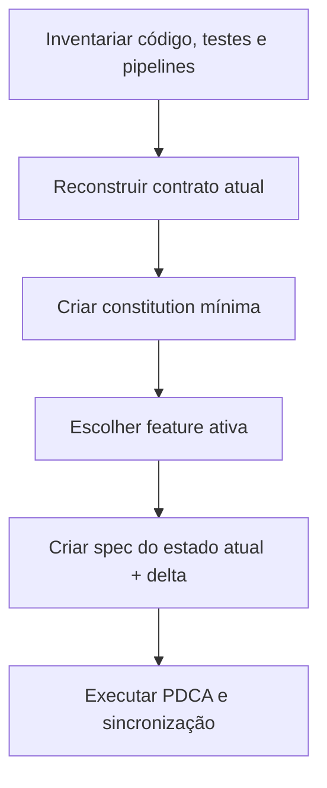

# SDD Lean para Machine Learning e Agentes

Método enxuto de Spec-Driven Development para projetos de Data Science, Machine Learning, inferência causal e agentes de IA.

O objetivo é manter intenção, código e evidências sincronizados sem criar uma coleção extensa de documentos.

> **Regra central:** a spec declara o que deve ser verdade; testes, runs, evals e traces mostram o que foi observado.

## Estrutura mínima

```text
spec/
├── constitution.md
└── features/
    ├── incident-risk-model/
    │   └── incident-risk-model.spec.md
    └── rca-companion-agent/
        └── rca-companion-agent.spec.md
```

| Artefato | Conteúdo | Tamanho de referência |
|---|---|---:|
| `constitution.md` | Outcome, escopo, princípios, stack, roadmap, gates e sincronização | 35–60 linhas |
| `features/<id>/<id>.spec.md` | Requirements, Plan, Validation e Act | 30–60 linhas |

Os limites são referências de revisão, não bloqueios. Complexidade real pode exigir conteúdo adicional, mas duplicações devem ser removidas.

## Responsabilidades

| Humano | Code agent |
|---|---|
| define intenção, limites e prioridades | investiga código e propõe specs |
| aprova critérios, métricas e pressupostos | implementa incrementos pequenos |
| decide quando aceitar ou replanejar | executa testes e organiza evidências |
| autoriza mudanças de contrato | compara código, diff e specs |
| aprova merge e roadmap | aponta divergências sem escondê-las |

O agente não deve inventar decisões de produto ou diminuir critérios para fazer uma implementação passar.

## Fluxo Greenfield



### 1. Setup inicial

**Humano**

- apresenta problema, usuários, restrições e fontes de dados conhecidas;
- indica decisões já tomadas e o que ainda está em aberto;
- define onde vivem código, dados, modelos, prompts, evals e traces.

**Agente**

- inspeciona o repositório;
- identifica stack, testes, pipelines e fontes de verdade;
- aponta dúvidas que realmente alteram o projeto.

**Saída:** visão mínima do projeto pronta para produzir a constitution. Use o prompt `G1` de [AGENT_PROMPTS.md](AGENT_PROMPTS.md).

### 2. Criar a constitution

**Humano**

- aprova outcome, escopo, princípios e premissas duradouras;
- confirma tech stack e roadmap `Now / Next / Later`;
- aprova quality gates e Definition of Done.

**Agente**

- produz `spec/constitution.md` em linguagem verificável;
- mantém apenas decisões estáveis;
- não transforma roadmap em backlog nem copia o lockfile.

**Saída:** constitution curta e aprovada. Use o prompt `G2`.

### 3. Criar a feature spec

Cada feature possui um único `<feature-id>.spec.md` com quatro seções:

1. **Requirements:** intenção, escopo, pressupostos e até sete critérios;
2. **Plan:** três a sete passos relevantes;
3. **Validation:** evidências esperadas e observadas;
4. **Act:** aceitar, replanejar ou interromper.

**Humano:** aprova escopo, métricas, limiares, guardrails e decisões científicas.

**Agente:** analisa constitution e código relacionado, propõe o contrato e aguarda aprovação antes de implementar.

**Saída:** feature pronta para o PDCA. Use `G3` e, quando necessário, `M1`, `C1` ou `A1`.

## Ciclo PDCA da feature



### Plan

- o humano aprova contrato e plano;
- o agente não implementa enquanto houver decisão material em aberto;
- em ML, os critérios incluem dados, split, baseline e métricas;
- em agentes, incluem tools, autonomia, parada, fallback e evals.

Use os prompts `G3`, `M1`, `C1` ou `A1`.

### Do

- o agente implementa apenas o próximo incremento;
- código e testes evoluem juntos;
- qualquer desvio do contrato é informado, não ocultado.

Use o prompt `G4`.

### Check

- o agente executa testes, métricas ou evals;
- `Validation` recebe somente status e referências às evidências;
- resultados completos permanecem em CI, tracker, registry ou observabilidade.

Use o prompt `G5`.

### Act

- o humano decide entre aceitar, corrigir, mudar justificadamente o contrato ou interromper;
- um limiar não pode ser reduzido silenciosamente depois de observar o resultado;
- a feature é replanejada no mesmo arquivo, removendo conteúdo superado quando deixar de ser útil.

Use o prompt `G6`.

## Sincronização contínua



### Quando atualizar a spec

Atualize quando mudar:

- intenção, escopo ou não-objetivo;
- pressuposto que pode invalidar a solução;
- interface ou comportamento observável;
- dados, target, estimand ou protocolo de avaliação;
- modelo, prompt, tool, routing, guardrail ou autonomia com impacto comportamental;
- métrica, limiar, risco ou fallback.

Não atualize apenas por uma nova run compatível, novo checkpoint, refactor interno ou resultado já representado na fonte de evidência.

### Gate do PR

Todo PR declara uma das opções:

```text
spec-impact: updated
```

```text
spec-impact: none
reason: refactor interno sem mudança de comportamento
```

Antes do merge, o agente executa o prompt `S1`. O humano confirma que toda mudança de contrato foi intencional.

## Revisão e replanejamento do projeto

O roadmap da constitution usa somente três horizontes:

```text
Now: resultado em execução
Next: próximo resultado priorizado
Later: direção provável, ainda revisável
```

Revisar quando uma feature for aceita, interrompida ou alterar uma premissa do projeto.



Use o prompt `R1`. O roadmap não deve acumular tarefas concluídas; Git preserva o histórico.

## Fluxo Brownfield

Em projetos existentes, a spec deve ser reconstruída a partir do comportamento atual antes de orientar novas mudanças.



### Procedimento

1. O agente inspeciona código, testes, configuração, dados, modelos, prompts e observabilidade.
2. Separa fatos comprovados de inferências e dúvidas.
3. O humano valida outcome, limites, stack, roadmap e comportamento crítico.
4. A constitution registra apenas o que é estável e atual.
5. A primeira feature spec descreve o comportamento relevante existente e a mudança desejada.
6. A adoção ocorre por feature; não é necessário documentar todo o legado antes de começar.

Use `B1`, `B2` e depois o mesmo PDCA Greenfield.

## Perfis especializados

### ML preditivo

Acrescente ao contrato: população, unidade e tempo de decisão, target, dataset, split, leakage, baseline, métrica, limiar, cortes críticos, drift e fallback.

### Inferência causal

Acrescente: estimand, tratamento, desfecho, unidade, população, horizonte, pressupostos/DAG, identificação, overlap, sensibilidade e limiar de decisão.

### Agente ou LangGraph

Acrescente: objetivo da trajetória, invariantes de estado, tools permitidas/proibidas, aprovação humana, parada, retries, fallback, dataset de eval, graders, qualidade, custo e latência.

## Checklist de fechamento da feature

- [ ] O estado da feature está correto.
- [ ] Os critérios descrevem o comportamento entregue.
- [ ] Cada critério possui evidência reproduzível.
- [ ] Falhas, limitações e resultados inconclusivos estão visíveis.
- [ ] Fallback e monitoramento foram definidos quando necessários.
- [ ] O diff foi comparado com constitution e feature spec.
- [ ] O PR contém `spec-impact`.
- [ ] O humano decidiu `accept`, `replan` ou `stop`.

## Outros documentos

- [AGENT_PROMPTS.md](AGENT_PROMPTS.md): prompts mínimos para cada etapa.
- [SDD_ADAPTATIONS.md](SDD_ADAPTATIONS.md): diferenças entre o curso e este método.
- [spec/constitution.md](spec/constitution.md): constitution de exemplo.
- [incident-risk-model.spec.md](spec/features/incident-risk-model/incident-risk-model.spec.md): feature de ML.
- [rca-companion-agent.spec.md](spec/features/rca-companion-agent/rca-companion-agent.spec.md): feature de agente.

## Referências

1. [DeepLearning.AI — Spec-Driven Development with Coding Agents](https://www.deeplearning.ai/courses/spec-driven-development-with-coding-agents/).
2. [OpenSpec — Concepts](https://github.com/Fission-AI/OpenSpec/blob/main/docs/concepts.md).
3. Sculley, D. et al. [Hidden Technical Debt in Machine Learning Systems](https://proceedings.neurips.cc/paper_files/paper/2015/file/86df7dcfd896fcaf2674f757a2463eba-Paper.pdf). NeurIPS, 2015.
4. [OpenAI — Evaluate Agent Workflows](https://developers.openai.com/api/docs/guides/agent-evals).
